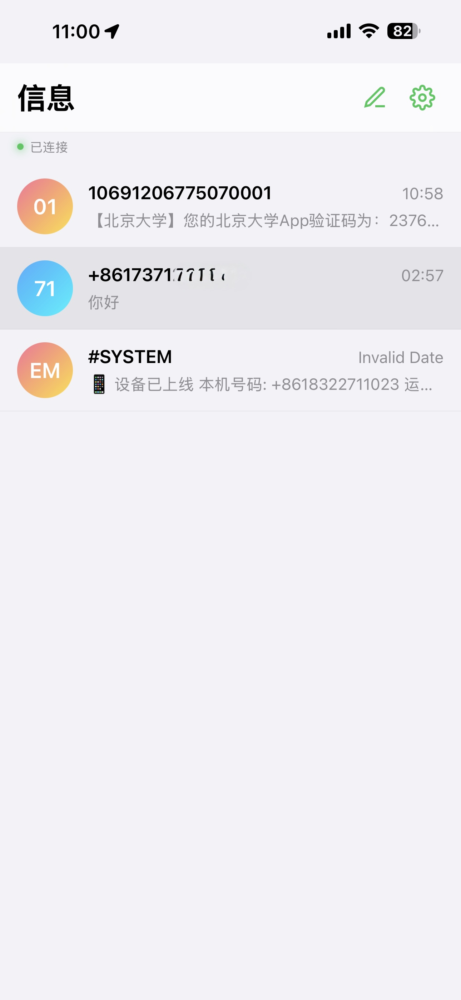
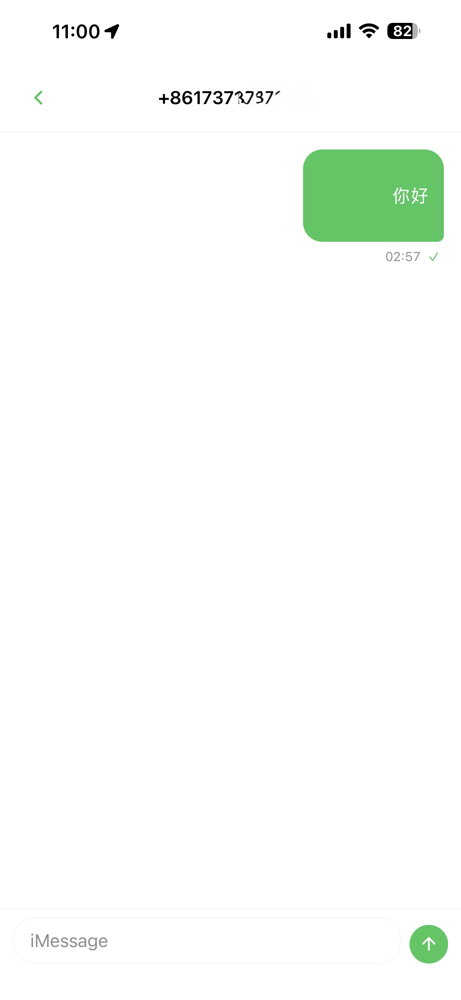
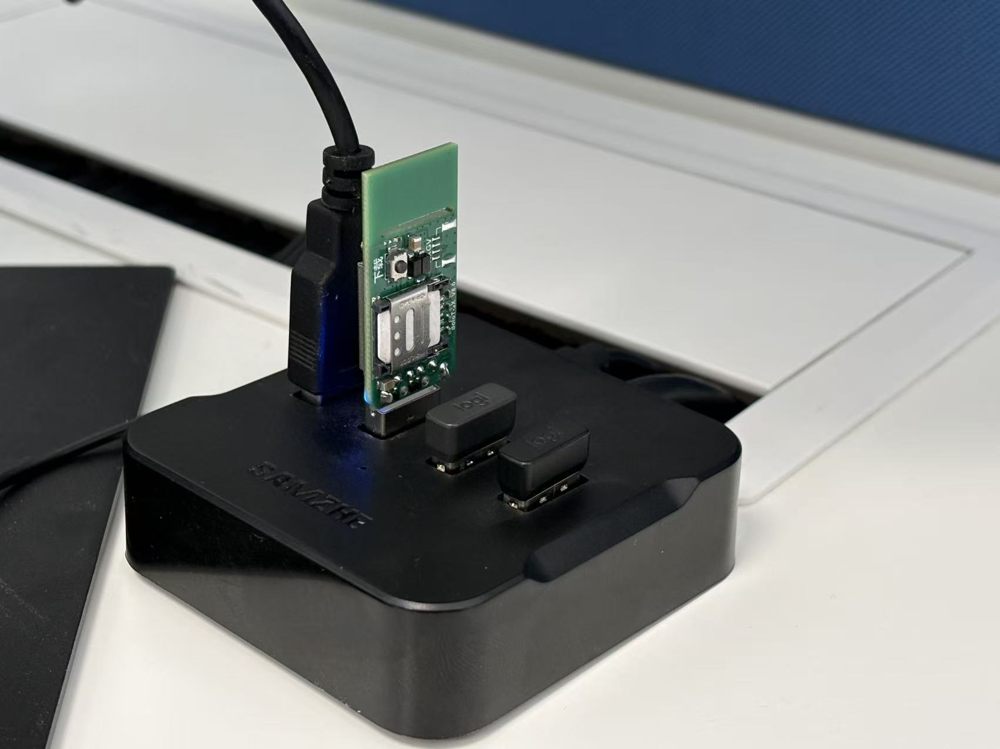

# 📱 SMS-Forwarder | DT718H 短信转发助手

[](https://opensource.org/licenses/MIT)
[](https://www.docker.com/)
[]()

> 基于 DT718H 4G 模组的高性能短信转发系统，支持多渠道通知推送和 iOS 体验的 Web 管理界面。

## 📁 项目结构

```
├── sms-device/         # 设备端 Lua 脚本 (刷入 DT718H)
├── sms-server/         # Web 服务器 (部署到云服务器/云平台)
├── soc/                # LuatOS 固件
├── tools/              # 刷机工具 (Luatools)
├── FILE_NOTES.md       # 项目代码审查与各文件详细备注
└── README.md           # 本文档
```

---

## 📸 界面预览

| 💬 接收消息 (iOS 风格) | 📤 发送短信 |
| :---: | :---: |
|  |  |

---

## 🛠️ 推荐硬件

本项目基于 **合宙 Air780E** 模组开发，具有极高的性价比和稳定性。

| 硬件实拍 | 推荐方案 |
| :---: | :--- |
|  | **Air780E 系列开发板**<br>· 4G 全网通物联网模块<br>· 支持 LuatOS 二次开发<br>· [🛒 点击前往淘宝购买](https://e.tb.cn/h.7gu14ADyoa5Ur7B?tk=B7RefAkj85l) |

---

## 🚀 快速开始

### 第一步：部署 Web 服务器

#### 方式一：使用 GitHub Container Registry (推荐)

```bash
# 拉取最新镜像 (支持 amd64/arm64)
docker pull ghcr.io/zhizinan1997/sms-forwarder/sms-server:latest

# 启动容器
docker run -d \
  --name sms-server \
  -p 3000:3000 \
  -v $(pwd)/data:/app/data \
  -e TZ=Asia/Shanghai \
  --restart unless-stopped \
  ghcr.io/zhizinan1997/sms-forwarder/sms-server:latest
```

> 💡 镜像支持 `linux/amd64` 和 `linux/arm64` 架构，可在 x86 服务器或树莓派等 ARM 设备上运行。

#### 方式二：云平台 PaaS 部署 (零成本/免维护)

如果您没有自己的服务器，可以先 **Fork 本项目**，然后使用以下平台一键部署（支持 Docker + SQLite 持久化 + WebSocket）：

##### 🟣 Zeabur (最推荐)

1. 在 [Zeabur](https://zeabur.com/) 创建项目，选择 **"Deploy Service"** → **"GitHub"**。
2. 设置 **Root Directory** 为 `sms-server`。
3. **关键步骤**：在服务设置面板中，点击 **"Storage"** -> **"Add Volume"**，挂载路径填 `/app/data`。

##### 🚂 Railway

1. 在 [Railway](https://railway.app/) 点击 **"New Project"** → **"Deploy from GitHub repo"**。
2. 在 **Settings** 中设置 **Root Directory** 为 `sms-server`。
3. **关键步骤**：点击 **"Add"** -> **"Volume"**，并将其映射到 `/app/data`。

##### ☁️ Render

1. 在 [Render](https://render.com/) 创建 **"Web Service"**，连接 GitHub 仓库。
2. 设置 **Runtime** 为 `Docker`，**Root Directory** 为 `sms-server`。
3. **注意**：Render 免费版不支持持久化存储，建议使用其付费版的 **"Disk"** 功能挂载 `/app/data`。

#### 方式三：本地构建/导入镜像

<details>
<summary>点击展开本地构建步骤</summary>

```bash
cd sms-server
# 使用 docker-compose 构建并启动
docker-compose up -d --build
```

或者手工导入镜像包：

```bash
docker load -i sms-server.tar
docker run -d ...
```

</details>

1. 访问 `http://你的域名或IP:3000`，默认密码：`admin`，登陆后请及时修改

### 第二步：刷入设备脚本

1. 安装刷机工具：运行 `tools/Luatools_v3.exe`

2. 连接 Air780E 设备到电脑 USB

3. 在 Luatools 中：
   - 选择 "项目管理" → "创建项目"
   - 选择底层固件：`soc/LuatOS-SoC_DT718H.soc`
   - 添加脚本：`sms-device/` 目录下所有 `.lua` 文件
   - 点击 "下载" 刷入设备

4. 修改配置后重新刷入生效

详细刷机教程，可以参考本页最后致谢部分的 [LuatOS 刷机教程](#luatos-刷机教程)
---

## ⚙️ 设备配置说明

编辑 `sms-device/config.lua`：

### 通知渠道配置

```lua
-- 支持同时配置多个渠道
NOTIFY_TYPE = {"dingtalk", "server"},
```

可选渠道：`telegram`, `pushdeer`, `bark`, `dingtalk`, `feishu`, `wecom`, `pushover`, `inotify`, `smtp`, `gotify`, `server`

### Web 服务器推送配置

```lua
SERVER_API = "http://你的服务器IP:3000",  -- 服务器地址
DEVICE_ID = "dt718h_01",                  -- 设备标识ID
SERVER_POLL_INTERVAL = 1000 * 10,          -- 轮询间隔(毫秒), 0=关闭
```

### 钉钉机器人配置

```lua
DINGTALK_WEBHOOK = "https://oapi.dingtalk.com/robot/send?access_token=xxx",
```

### 飞书机器人配置

```lua
FEISHU_WEBHOOK = "https://open.feishu.cn/open-apis/bot/v2/hook/xxx",
```

### 企业微信机器人配置

```lua
WECOM_WEBHOOK = "https://qyapi.weixin.qq.com/cgi-bin/webhook/send?key=xxx",
```

### Bark 推送配置 (iOS)

```lua
BARK_API = "https://api.day.app",
BARK_KEY = "你的key",
```

### SMTP 邮件配置

```lua
SMTP_HOST = "smtp.163.com",
SMTP_PORT = 25,
SMTP_USERNAME = "your@163.com",
SMTP_PASSWORD = "授权码",
SMTP_MAIL_FROM = "your@163.com",
SMTP_MAIL_TO = "receive@example.com",
SMTP_MAIL_SUBJECT = "来自 DT718H 的通知",
```

### 其他设置

```lua
BOOT_NOTIFY = true,              -- 开机发送通知
NOTIFY_APPEND_MORE_INFO = true,  -- 追加设备信息(IMEI、信号等)
NOTIFY_RETRY_MAX = 3,            -- 通知失败重试次数
LOCATION_INTERVAL = 0,           -- 基站定位间隔(毫秒), 0=关闭
LOW_POWER_MODE = false,          -- 低功耗模式
```

---

## 🖥️ Web 管理界面

### 功能特性

- 📱 iOS 风格 UI，支持深色/浅色模式
- 🔄 WebSocket 实时更新
- 💬 查看短信会话列表
- 📤 发送短信（自动标准化手机号格式）
- 🔒 密码登录保护
- 📱 PWA 支持，可添加到手机桌面
- 👤 **管理员控制台** - 独立的管理后台
- 🔑 **子账号系统** - 支持多用户不同权限访问

### 🔐 管理员控制台

访问 `/admin.html` 进入管理员控制台。

#### 首次使用

1. 首次访问会提示**初始化管理员账号**
2. 设置管理员用户名（至少3位）和密码（至少4位）
3. 创建成功后跳转到登录页面

#### 管理员功能

- **修改密码** - 更新管理员登录密码
- **子账号管理** - 创建、编辑、删除子账号
- **快捷入口** - 快速跳转到短信界面

### 👥 子账号与短信筛选

子账号系统允许您为不同用户设置不同的访问权限，通过**密码**区分用户，每个密码可配置独立的**短信筛选规则**。

#### 添加子账号

在管理员控制台点击「+ 添加子账号」：

| 字段 | 说明 |
|------|------|
| 登录密码 | 用户在短信界面登录时使用的密码（至少4位） |
| 筛选类型 | `显示所有短信` / `内容包含关键词` / `发送者匹配` |
| 筛选关键词 | 当筛选类型非"全部"时，填写匹配关键词 |
| 备注说明 | 可选，方便管理员识别 |

#### 使用示例

| 密码 | 筛选类型 | 筛选值 | 效果 |
|------|----------|--------|------|
| `666666` | 显示所有短信 | - | 登录后可查看全部短信 |
| `88888888` | 内容包含关键词 | `北京大学` | 只显示内容包含"北京大学"的短信 |
| `999999` | 发送者匹配 | `10086` | 只显示来自10086的短信 |

> 💡 子账号登录后，所有短信查询都会自动应用对应的筛选规则。

### Docker 常用命令

```bash
# 查看容器日志
docker logs -f sms-server

# 停止容器
docker stop sms-server

# 启动容器
docker start sms-server

# 重启容器
docker restart sms-server

# 删除容器
docker rm -f sms-server
```

### API 接口

#### 认证接口

| 方法 | 路径 | 说明 | 认证 |
|------|------|------|------|
| POST | `/api/auth/login` | 用户登录（支持子账号密码） | 否 |
| POST | `/api/auth/change-password` | 修改密码 | 是 |

#### 短信接口

| 方法 | 路径 | 说明 | 认证 |
|------|------|------|------|
| GET | `/api/sms/conversations` | 获取会话列表（自动筛选） | 是 |
| GET | `/api/sms/messages/:phone` | 获取对话消息（自动筛选） | 是 |
| GET | `/api/sms/list` | 获取所有短信（自动筛选） | 是 |
| POST | `/api/sms/send` | 发送短信请求 | 是 |
| GET | `/api/sms/outbox` | 获取发件箱 | 是 |
| POST | `/api/sms/receive` | 设备推送短信 | 否 |
| GET | `/api/sms/pending` | 设备获取待发任务 | 否 |
| POST | `/api/sms/sent` | 设备回报发送结果 | 否 |

#### 管理员接口

| 方法 | 路径 | 说明 | 认证 |
|------|------|------|------|
| GET | `/api/admin/status` | 检查管理员是否已初始化 | 否 |
| POST | `/api/admin/init` | 首次初始化管理员账号 | 否 |
| POST | `/api/admin/login` | 管理员登录 | 否 |
| POST | `/api/admin/change-password` | 修改管理员密码 | 管理员 |
| GET | `/api/admin/sub-accounts` | 获取子账号列表 | 管理员 |
| POST | `/api/admin/sub-accounts` | 添加子账号 | 管理员 |
| PUT | `/api/admin/sub-accounts/:id` | 更新子账号 | 管理员 |
| DELETE | `/api/admin/sub-accounts/:id` | 删除子账号 | 管理员 |

---

## 📂 文件说明

### sms-device/

| 文件 | 说明 |
|------|------|
| `main.lua` | 主入口，初始化和短信接收处理 |
| `config.lua` | 配置文件 |
| `util_notify.lua` | 多渠道通知推送模块 |
| `util_server.lua` | 服务器通信模块 (推送短信、轮询待发) |
| `lib_smtp.lua` | SMTP 邮件发送库 |
| `util_location.lua` | 基站定位模块 |
| `util_mobile.lua` | 手机号/IMEI/运营商信息 |
| `util_netled.lua` | 网络状态 LED 指示 |
| `util_http.lua` | HTTP 请求工具 |

### sms-server/

| 文件 | 说明 |
|------|------|
| `server.js` | Express REST API + WebSocket 服务 |
| `database.js` | SQLite 数据库操作（含管理员/子账号） |
| `public/index.html` | 短信界面前端页面 |
| `public/style.css` | iOS 风格样式表 |
| `public/app.js` | 短信界面交互逻辑 |
| `public/admin.html` | 管理员控制台页面 |
| `public/admin.css` | 管理员界面专用样式 |
| `public/admin.js` | 管理员界面交互逻辑 |
| `public/manifest.json` | PWA 配置 |
| `public/logo.png` | 应用图标 |

---

## 🔄 工作流程

```
┌─────────────┐     短信推送      ┌─────────────┐     网页查看
│  Air780E    │ ───────────────► │  Web 服务器  │ ◄───────────── 用户
│  设备端     │                   │  (Docker)   │
│             │ ◄─────────────── │             │ ───────────── 用户
└─────────────┘    轮询待发任务    └─────────────┘    发送短信请求
       │                                │
       │          发送短信              │
       └────────────────────────────────┘
```

1. **收短信**: 设备收到短信 → 推送到服务器 → WebSocket 实时通知网页
2. **发短信**: 用户在网页提交 → 服务器标准化号码并存入队列 → 设备轮询获取 → 设备发送 → 回报结果

---

## ⚠️ 注意事项

1. **流量消耗**: 每条通知会消耗移动网络流量，建议使用物联网卡
2. **安全性**: 生产环境请修改默认密码，建议配置 HTTPS
3. **防火墙**: 确保服务器 3000 端口对外开放
4. **时区**: Docker 容器已配置为 `Asia/Shanghai` 时区
5. **手机号格式**: 系统自动将各种格式转换为 `+86XXXXXXXXXXX` 标准格式

---

## 文件目录结构及说明

### 1. 硬件端 (sms-device)

基于 LuatOS 开发，负责短信接收、网络连接和多种渠道的通知。

- **[main.lua](file:///c:/Users/Administrator/Downloads/SMS-Forwarder/sms-device/main.lua)**: 项目入口文件。负责系统初始化、硬件控制（看门狗、按键）、短信回调注册以及启动各个功能任务。
- **[config.lua](file:///c:/Users/Administrator/Downloads/SMS-Forwarder/sms-device/config.lua)**: 全局配置文件。包含了通知渠道设置、API 地址、SMTP 配置、定位间隔等参数。
- **[util_notify.lua](file:///c:/Users/Administrator/Downloads/SMS-Forwarder/sms-device/util_notify.lua)**: 核心通知模块。支持 Telegram, SMTP, Bark, Gotify, DingTalk 等多种推送方式，并实现了失败重试的消息队列。
- **[util_server.lua](file:///c:/Users/Administrator/Downloads/SMS-Forwarder/sms-device/util_server.lua)**: 与后端服务器通信的模块。负责从服务器获取待发送短信（Outbox）并上报发送结果。
- **[util_mobile.lua](file:///c:/Users/Administrator/Downloads/SMS-Forwarder/sms-device/util_mobile.lua)**: 移动网络工具类。用于获取运营商信息、信号强度、流量统计等。
- **[util_location.lua](file:///c:/Users/Administrator/Downloads/SMS-Forwarder/sms-device/util_location.lua)**: 地理位置模块。通过基站信息进行定位，并返回地图链接。
- **[util_netled.lua](file:///c:/Users/Administrator/Downloads/SMS-Forwarder/sms-device/util_netled.lua)**: 网络指示灯控制。通过闪烁频率反馈网络状态（未联网、已联网）。
- **[util_http.lua](file:///c:/Users/Administrator/Downloads/SMS-Forwarder/sms-device/util_http.lua)**: HTTP 请求封装库。提供基础的 GET/POST 操作。
- **[lib_smtp.lua](file:///c:/Users/Administrator/Downloads/SMS-Forwarder/sms-device/lib_smtp.lua)**: SMTP 协议实现。用于通过邮件服务器发送短信内容。

### 2. 服务器端 (sms-server)

基于 Node.js Express 框架，提供短信存储、网页查看和转发任务管理。

- **[server.js](file:///c:/Users/Administrator/Downloads/SMS-Forwarder/sms-server/server.js)**: 后端主进程。处理 RESTful API（登录、短信接收、会话列表、发送请求）和 WebSocket 实时推送。
- **[database.js](file:///c:/Users/Administrator/Downloads/SMS-Forwarder/sms-server/database.js)**: 数据库操作层。使用 SQLite 存储短信内容、设置及待发送队列。
- **public/**: 前端静态资源目录。包含网页界面逻辑（通常是 HTML/JS/CSS）。
- **[Dockerfile](file:///c:/Users/Administrator/Downloads/SMS-Forwarder/sms-server/Dockerfile)**: Docker 镜像配置文件，方便一键部署。
- **[docker-compose.yml](file:///c:/Users/Administrator/Downloads/SMS-Forwarder/sms-server/docker-compose.yml)**: Docker 编排配置，定义服务容器及其数据卷挂载。

---

## 代码审查建议

1. **安全性**:
   - `server.js` 中使用了简单的静态密码，建议在生产环境增加密码哈希存储。
   - `config.lua` 中包含敏感信息（Token, 密码），应提醒用户保护此文件或使用环境变量（在服务器端）。

2. **健壮性**:
   - `util_notify.lua` 已经实现了重试机制，非常优秀。但在极端弱网环境下，可以考虑持久化存储待发消息。
   - `database.js` 应该在启动时检查并创建 `data` 目录（已实现）。

3. **可维护性**:
   - 目前注释较为详尽，但在某些复杂的逻辑块（如 `lib_smtp.lua`）可以增加更详细的协议解释。
   - 建议增加日志分级管理，避免生产环境输出过多调试信息。

## � 致谢

本项目基于以下项目二次开发：

- [【解决方案】合宙air780e硬件实现短信转发 最终版本](https://www.yuque.com/pengzhiqiang999/xiaokenai/bhzrqf68i9i07qac) - 感谢 @pengzhiqiang999 提供的原始方案

---

## �📄 许可证

MIT License
